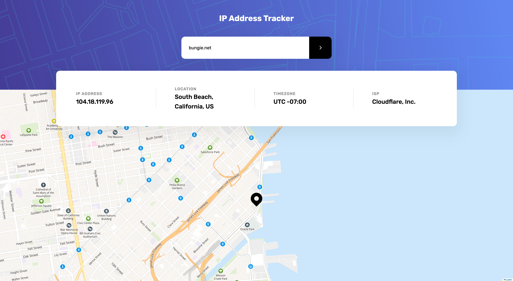

# Frontend Mentor - IP address tracker solution

This is a solution to the [IP address tracker challenge on Frontend Mentor](https://www.frontendmentor.io/challenges/ip-address-tracker-I8-0yYAH0). Frontend Mentor challenges help you improve your coding skills by building realistic projects.

## Table of contents

- [Overview](#overview)
  - [The challenge](#the-challenge)
  - [Screenshot](#screenshot)
  - [Links](#links)
- [My process](#my-process)
  - [Built with](#built-with)
  - [What I learned](#what-i-learned)
  - [Continued development](#continued-development)
  - [Useful resources](#useful-resources)
- [Author](#author)

## Overview

### The challenge

Users should be able to:

- View the optimal layout for each page depending on their device's screen size
- See hover states for all interactive elements on the page
- See their own IP address on the map on the initial page load
- Search for any IP addresses or domains and see the key information and location

### Screenshot

### Links

- Solution URL: [Solution URL](https://www.frontendmentor.io/solutions/ip-tracking-app-DeXUK80F9L)
- Live Site URL: [Live Site URL](https://ip-tracking-app-ai.netlify.app/)

## My process

### Built with

- Semantic HTML5 markup
- CSS custom properties
- Flexbox
- CSS Grid
- Mobile-first workflow
- [React](https://reactjs.org/) - JS library
- [Leaflet](https://leafletjs.com/) - Map library

### What I learned

By building this app I've introduced myself to the Leaflet mapping library. In addition to that I practiced my existing React skills.

### Continued development

I the future I'd like to get more proficient in React.

### Useful resources

On this [link](https://dev.to/gedalyakrycer/ohsnap-sass-folder-structure-for-react-483e) you can find the folder structure that I used to implement Sass in to this React project.

On this [link](http://getbem.com/) you can learn more about BEM naming convention that I used to name my classes in this project.ewing your solution or for yourself when you look back on this project in the future.\*\*

## Author

- Frontend Mentor - [@andrijaivkovic](https://www.frontendmentor.io/profile/andrijaivkovic)
- Twitter - [@AndrijaIvkovic1](https://twitter.com/AndrijaIvkovic1)
